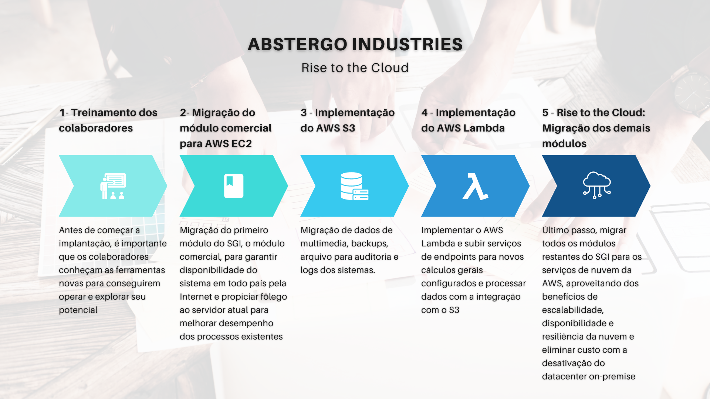

# RELATÓRIO DE IMPLEMENTAÇÃO DE SERVIÇOS AWS ☁️

Data: 01/04/2024
Empresa: Abstergo Industries 
Responsável: Luis Zancanela

## 📌 Introdução
Este relatório apresenta o processo de implementação de ferramentas na empresa Abstergo Industries, realizado por Luis Zancanela. O objetivo do projeto foi elencar 3 serviços AWS, com a finalidade de realizar diminuição de custos imediatos.

## 📷 Cenário atual (AS IS)
A empresa Abstergo Industries fabrica e distribui produtos farmacêuticos por todo o Brasil.  
A organização possui um Sistema de Gestão Integrada (SGI) que atende os setores produtivo, comercial, financeiro e contábil da organização. Para funcionar o sistema, a empresa possui um datacenter próprio que concentra os servidores para os módulos do SGI.  
O problema é que para atender a operação atual a estrutura está saturada e precisa ampliar a capacidade computacional, a disponibilidade do sistema e melhorar a opção de backup e recuperação para evitar perdas com indisponibilidade de sistemas críticos caso ocorra problemas ou desastres. 
Além da necessidade de ampliação, o conselho fiscal e a diretoria estão relutantes em aumentar o orçamento para tecnologia, visto que aumentar custos pode diretamente refletir em diminuição de margem, aumento de preços de venda e indiretamente na competitividade da empresa no mercado.  
**Problema: Será possível ampliar operação de tecnologia, mitigar risco e ainda não estourar o orçamento?**

## 🔢 Opções para Solução
Em geral, a necessidade de ampliação da capacidade computacional, disponibilidade e resilência para os sistemas pode seguir por dois caminhos:  
1- Aquisição de novos servidores, nobreak, gerador de energia, switchs para rede, redundância de link de internet de alta velocidade, contratação de softwares para backup e restauração  
2- Contratação de serviços em nuvem com ferramentas/serviços para suprir as necessidade e redundância de link de internet com velocidade reduzida.
Consideran  
A primeira opção denota ampliação da estrutura mantendo o controle total para os serviços de tecnologias que a empresa precisa, porém vai necessitar um alto investimento inicial e até amplicação de mão de obra para implantação, configuração e sustentação da estrutura extra. Apesar do alto custo ser no investimento e depois poder manter operação sem grandes custos, ainda assim esta opção ainda causa o estouro do orçamento atual, fazendo com que seja uma opção possível somente para planejamentos futuros.
A segunda opção possibilita a contratação dos serviços em nuvem como custos operacionais e não exige investimento prévio. Neste modelo de contratação de serviços, a Abstergo Industries terá apenas que se preocupar com custo operacional que pode ser adequado ao limite do orçamento. A vantagem de utilizar serviços de nuvem é pagar pelo que usa, sem necessidade de alto investimento na infraestrutura física e de contratação de profissionais especialistas para esta parte física básica.  
Partindo da opções acima, o mais adequado no momento é procurar pelos serviços em nuvem, portanto **este projeto visa propor solução para o problema do cenário atual utilizando serviços de nuvem da AWS.**

## 📝 Descrição do Projeto (TO BE)

Antes de iniciar a implantação do projeto em si com os serviços, o ideal é que os colaboradores de tecnologia da empresa façam cursos e treinamento para os produtos da AWS para conhecerem os serviços que serão utilizados nas etapas de implementação deste projeto.

O projeto de implementação de ferramentas da AWS foi dividido em 3 etapas, cada uma com seus objetivos específicos. A seguir, serão descritas as etapas do projeto:

#### 💻 Etapa 1: 
- **Amazon EC2**
- Página oficial da ferramenta: https://aws.amazon.com/pt/ec2/
- O serviço EC2 irá disponibilizar instância para configurar servidor na nuvem, com essa ferramenta, além de expandir a capacidade de processamento das operaçãos do SGI, é possível até mesmo migrar os módulos do SGI atualmente utilizados no datacenter próprio/local (on-premise) para deixar o sistema totalmente em nuvem. É uma opção flexível que permite escalabilidade para aumentar poder computacional caso for necessário em situações de picos de usos. 
- **Casos de uso:**
  - Migrar o módulo comercial para instância EC2 para garantir maior disponibilidade de acesso através da internet fixa ou móvel de qualquer lugar do Brasil, facilitando a mobilidade dos vendedores e representantes. Com a migração do módulo é possível gerar ociosadade no servidor atual para ser aproveitada pelos outros serviços que ainda continuam, além de que caso o módulo comercial necessite de processamento extra, tem a opção de escalabilidade.
  - Migrar todos os módulos para garantir maior disponibilidade do sistema e poder diminuir ou eliminar a necessidade do datacenter próprio/on-premise. Além de poder reduzir custo com infraestrutura de TI, que não é o foco da empresa, ainda continua se aproveitando do benefício da escabilidade.
  - Possibilidade de criação de novas aplicações web based.

#### 💾 Etapa 2: 
- **Amazon S3**
- Página oficial da ferramenta: https://aws.amazon.com/pt/s3/
- Com o serviço S3 da AWS é possível armazenar dados de diversos tipos com escalabilidade, disponibilidade, segurança e performance. Com este serviço é possível não só guardar dados para gerenciá-los, mas também pode permitir até criação de data lake para centralizar fonte de dados para as informações importantes da empresa.
- **Casos de uso:**
  - Migrar dados arquivos que necessitam ser guardados para auditoria.
  - Poder guardar arquivos que podem ser facilmente integrados/acessados com as aplicações já existentes ou novas.
  - Guardar logs das aplicações para facilitar auditorias.
  - Guardar backups de dados para fácil recuperação.

#### ⚡ Etapa 3: 
- **AWS Lambda**
- Página oficial da ferramenta: https://aws.amazon.com/pt/lambda/
- Com o AWS Lambda é um serviço que executa código em resposta a eventos e gerencia automaticamente os recursos computacionais automaticamente. Esses eventos podem incluir mudanças no estado ou uma atualização, como um usuário colocando um item em um carrinho de compras de um site de comércio eletrônico. Este serviço pode disponibilizar endpoints HTTP para serem chamados pelos sistemas da empresa, ou então ter integração com recursos como o S3.
- **Casos de uso:**
  - Endpoint para cálculos diversos e pontuais como conversão de moeda, tributo/taxa específico não configurado nos módulos, 
  - Processamento de dados do S3

## 🎯 Conclusão
A implementação de ferramentas de nuvem da AWS na empresa **Abstergo Industries** tem como esperado **maiores garantias de escalabilidade, disponibilidade e resiliência sem o alto custo de investimento, além de poder contar com serviço como o Lambda para criar e resolver problemas e desafios pontuais**, o que aumentará a eficiência e a produtividade da empresa. Recomenda-se a continuidade da utilização das ferramentas implementadas e a busca por novas tecnologias que possam melhorar ainda mais os processos da empresa.

## 📎 Anexo

Assinatura do Responsável pelo Projeto:

✒️ Luis Zancanela